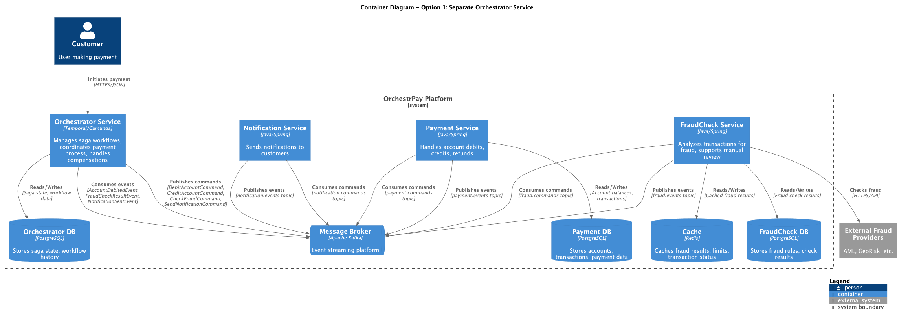
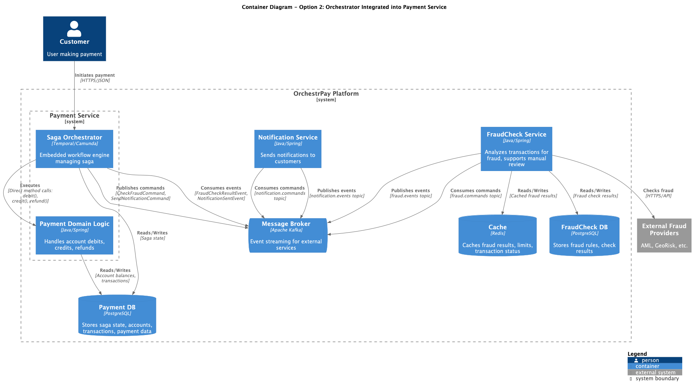

# ADR: Saga Orchestrator Placement for Payment Processing

## General Information

1. **Parent Artifact**: OrchestrPay Payment Platform Architecture
2. **Author**: Iaroslav L
3. **Status**: Accepted
4. **Approvers**: Payment Services Team Lead, Platform Architect, Security Team Lead

## Context

OrchestrPay payment platform implements Saga orchestration pattern to manage distributed transactions across Payment
Service, FraudCheck Service, and Notification Service. The saga involves multiple compensatable transactions (
CREATE_PAYMENT, DEBIT_CUSTOMER_ACCOUNT), a pivot transaction (CREDIT_MERCHANT_ACCOUNT), and complex flows including
manual review with 20-minute timeouts.

**Key Requirements:**

- Handle complex state machine with 10+ states (CREATED, DEBITED, FRAUD_CHECKING, MANUAL_REVIEW_PENDING, etc.)
- Manage compensation flows to prevent money getting stuck between systems
- Support manual review workflow with timeout-based default approval
- Ensure reliable state persistence and recovery
- Provide clear monitoring and traceability for business and security teams
- Meet SLA: <5 seconds for 90% of successful transactions

**Critical Constraint:** The orchestrator must not fail - losing saga state would result in money stuck in limbo,
violating the core business requirement.

**Decision Required:** Should the saga orchestrator logic be placed in a separate dedicated service or integrated within
the Payment Service?

## Considered Options

### Option 1: Separate Orchestrator Service

**Architecture:**

**Implementation:**

- Dedicated microservice hosting Temporal Workflow Workers or Camunda Engine
- Orchestrator sends command events to Kafka topics, domain services consume and process
- Domain services publish reply events back to Kafka
- Event-driven communication via Kafka topics:
    - `payment.commands` - debit, credit, refund commands
    - `fraud.commands` - fraud check requests
    - `notification.commands` - notification requests
    - `payment.events` - debit completed, credit completed, refund completed
    - `fraud.events` - fraud check results (approved/rejected/manual review)
    - `notification.events` - notification status
- State persisted in Orchestrator's database (PostgreSQL)
- Transactional Outbox pattern ensures reliable event publishing from all services

**Communication Flow:**

1. Client → Orchestrator: `POST /payments` (initiate saga via HTTP)
2. Orchestrator → Kafka: Publish `DebitAccountCommand` to `payment.commands`
3. Payment Service consumes command → executes debit → publishes `AccountDebitedEvent` to `payment.events`
4. Orchestrator consumes event → publishes `CheckFraudCommand` to `fraud.commands`
5. FraudCheck Service consumes command → checks fraud → publishes `FraudCheckResultEvent` to `fraud.events`
6. Orchestrator consumes result → publishes `CreditAccountCommand` to `payment.commands` (if approved)
7. Payment Service consumes command → executes credit → publishes `AccountCreditedEvent` to `payment.events`
8. Orchestrator consumes event → publishes `SendNotificationCommand` to `notification.commands`
9. Notification Service consumes command → sends notification → publishes `NotificationSentEvent` to
   `notification.events`

### Option 2: Orchestrator Integrated into Payment Service

**Architecture:**

**Implementation:**

- Temporal Workflow Workers or Camunda Engine embedded in Payment Service
- Saga orchestration code runs in same service boundary as payment domain logic
- Direct method calls for local operations (debit/credit/refund)
- Kafka-based communication with external services (FraudCheck, Notification)
- Event topics:
    - `fraud.commands` - fraud check requests
    - `notification.commands` - notification requests
    - `fraud.events` - fraud check results
    - `notification.events` - notification status
- Shared database for saga state and payment data
- Transactional Outbox pattern for external events

**Communication Flow:**

1. Client → Payment Service: `POST /payments` (initiate saga via HTTP)
2. Payment Service (internal): Execute debit logic directly
3. Payment Service → Kafka: Publish `CheckFraudCommand` to `fraud.commands`
4. FraudCheck Service consumes command → publishes `FraudCheckResultEvent` to `fraud.events`
5. Payment Service consumes event → executes credit logic directly (if approved)
6. Payment Service → Kafka: Publish `SendNotificationCommand` to `notification.commands`
7. Notification Service consumes command → publishes `NotificationSentEvent` to `notification.events`

## Comparison of Options

| Option                                        | Advantages                                                                                                                                                                                                                                                                                                                                                                                                                                                                                                                                                                                                                                                                                                                                                  | Disadvantages                                                                                                                                                                                                                                                                                                                                                                                                                                                                                                                                                                                                                                                                                                 |
|-----------------------------------------------|-------------------------------------------------------------------------------------------------------------------------------------------------------------------------------------------------------------------------------------------------------------------------------------------------------------------------------------------------------------------------------------------------------------------------------------------------------------------------------------------------------------------------------------------------------------------------------------------------------------------------------------------------------------------------------------------------------------------------------------------------------------|---------------------------------------------------------------------------------------------------------------------------------------------------------------------------------------------------------------------------------------------------------------------------------------------------------------------------------------------------------------------------------------------------------------------------------------------------------------------------------------------------------------------------------------------------------------------------------------------------------------------------------------------------------------------------------------------------------------|
| **Option 1: Separate Orchestrator Service**   | - **Clear separation of concerns**: Orchestration logic isolated from domain logic - **Reusability**: Can orchestrate multiple business processes (payments, refunds, settlements) - **Independent scaling**: Scale orchestrator based on saga complexity, not transaction volume - **Technology flexibility**: Change orchestration engine without touching domain services - **Team autonomy**: Different teams can own orchestrator and domain services - **Easier testing**: Test orchestration logic independently from domain logic - **Better observability**: Centralized view of all saga executions - **Event-driven architecture**: Full EDA implementation with Kafka enables async processing, replay, and event sourcing | - **Operational complexity**: One more service to deploy, monitor, and maintain - **Data consistency overhead**: Saga state and payment data in different databases - **Kafka infrastructure**: Requires Kafka cluster management and monitoring - **Message ordering complexity**: Must handle out-of-order events and idempotency - **Increased infrastructure cost**: Separate service + Kafka resources                                                                                                                                                                                                                                                                                       |
| **Option 2: Orchestrator in Payment Service** | - **Local optimization**: Direct method calls for debit/credit/refund (no Kafka overhead for payment operations) - **Simpler deployment**: Fewer services to manage - **Transactional consistency**: Saga state and payment data in same database (single transaction possible) - **Fewer Kafka topics**: Only for external services (fraud, notifications) - **Lower infrastructure cost**: No additional service resources needed - **Hybrid approach**: Direct calls internally, events for external services                                                                                                                                                                                                                             | - **Tight coupling**: Orchestration logic coupled with payment domain logic - **Limited reusability**: Orchestrator tied to Payment Service, hard to reuse for other processes - **Scaling inefficiency**: Must scale entire Payment Service even if only orchestration is bottleneck - **Technology lock-in**: Harder to change orchestration technology - **Reduced team autonomy**: Single team owns both concerns - **Testing complexity**: Must test orchestration and domain logic together - **Violates single responsibility**: Service handles both domain logic and process coordination - **Partial EDA**: Not fully event-driven, limits audit trail and replay capabilities |

## Decision

**Chosen Option: Option 1 - Separate Orchestrator Service**

**Rationale:**

1. **Architectural Alignment with Requirements:**
    - Course explicitly focuses on "orchestrator as separate service", "Saga with Orchestrator", and "EDA"
    - Separation enables proper implementation of Event-Driven Architecture
    - Kafka-based communication provides full event sourcing and audit trail
    - Better aligns with microservice architecture principles

2. **Event-Driven Architecture Benefits:**
    - **Async processing**: Services process commands independently, improving throughput
    - **Event replay**: Can replay fraud.events or payment.events for debugging or reprocessing
    - **Audit trail**: Complete event log for compliance and security analysis
    - **Temporal decoupling**: Services don't need to be available simultaneously
    - **Scalability**: Consumer groups enable parallel processing

3. **Reusability for Future Processes:**
    - OrchestrPay will need additional sagas: refunds, settlements, chargebacks, recurring payments
    - Separate orchestrator can manage all these processes without bloating domain services
    - Kafka topics can be reused across multiple sagas (e.g., payment.commands for all payment-related processes)
    - Enables building a platform capability rather than one-off solution

4. **Team Scalability:**
    - Payment Services team focuses on domain logic (consuming/producing payment events)
    - Platform/Infrastructure team owns orchestration service and Kafka infrastructure
    - Clearer ownership boundaries reduce coordination overhead
    - Teams can evolve independently via event schemas/contracts

5. **Technology Evolution:**
    - Starting with Temporal, but may evaluate Camunda or custom solutions
    - Separate service allows experimentation without disrupting payment processing
    - Can A/B test different orchestration approaches
    - Kafka as stable contract layer - can change service implementations behind it

6. **Observability and Debugging:**
    - Centralized saga monitoring dashboard shows all payment flows
    - Kafka event streams provide complete audit trail
    - Security team can trace fraud check delays via fraud.events topic
    - Business analysts can consume events for analytics without impacting production
    - Can use Kafka tools (Kafdrop, Kafka UI) for message inspection

7. **Performance Considerations Addressed:**
    - Kafka latency (p99 < 10ms) is negligible within <5s SLA
    - Critical path is fraud check (external provider latency 100-500ms), not orchestration
    - Async processing improves throughput - don't wait for notifications before completing saga
    - Can parallelize: issue credit command while notification is being sent
    - Kafka partitioning enables horizontal scaling

8. **Operational Risk Management:**
    - Kafka provides message durability - no lost commands if orchestrator crashes
    - Consumer offset management enables exactly-once processing semantics
    - Dead letter topics for failed messages enable manual intervention
    - Can implement gradual rollout: start with simple payments, expand to complex scenarios
    - Circuit breakers on fraud check consumers prevent cascade failures

**Trade-offs Accepted:**

- Additional operational complexity (Kafka + orchestrator) is acceptable given strong DevOps/SRE team
- Eventual consistency model requires careful idempotency design
- Message ordering requires partition key strategy (by payment ID)
- Infrastructure cost justified by flexibility, audit trail, and future process reuse

**Implementation Notes:**

- **Orchestration Engine**: Temporal as primary (native saga support, built-in retries, durable timers)
- **Kafka Topics**:
    - `payment.commands` (partitioned by payment ID)
    - `payment.events` (partitioned by payment ID)
    - `fraud.commands` (partitioned by transaction ID)
    - `fraud.events` (partitioned by transaction ID)
    - `notification.commands` (partitioned by customer ID)
    - `notification.events` (partitioned by customer ID)
- **Consumer Groups**: Each service has dedicated consumer group for commands
- **Idempotency**: Use message key (transaction ID) + deduplication table
- **Transactional Outbox**: All services use outbox pattern for reliable event publishing
- **Dead Letter Queues**: Configure DLQ for failed messages (retry exhausted)
- **Monitoring**:
    - Kafka lag monitoring (alert if lag > 100 messages)
    - Saga completion time (alert if >4s)
    - DLQ message count (alert if > 0)
- **High Availability**: Deploy orchestrator with 3+ replicas, Kafka cluster with 3+ brokers

**Alternative for Consideration:**
Option 2 (integrated orchestrator) can be prototyped as proof-of-concept to validate performance assumptions, but
production implementation should follow Option 1 for reasons stated above.
